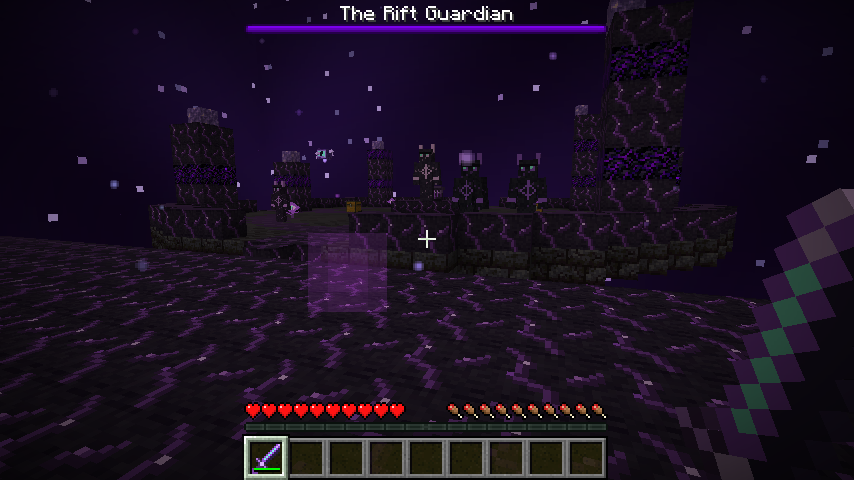

# Riftborn

A survival adventure mod for **Minecraft Java Edition 1.21.1**, **Fabric**, and **Java 21**.

Mine purple-veined Rift Stone, follow the signals of ruined dimensional anchors, and cross into a dark sky full of floating islands. Hunt Rift creatures, awaken **The Rift Guardian**, and forge its Heart into a **Riftblade** that lets you blink through open space.



*Actual in-game capture from the automated client/server test; the shrine is placed as a test exhibition.*

## Requirements

| Component | Supported / pinned version |
| --- | --- |
| Minecraft Java Edition | **1.21.1** (not 1.21.2+) |
| Java | **21** |
| Fabric Loader | **0.16.10** or a compatible newer version |
| Fabric API | **0.116.6+1.21.1**; use the **1.21.1** build |
| Development mappings | Yarn **1.21.1+build.3** |
| Build tooling | Fabric Loom **1.8.13**, Gradle **8.10.2** |

Riftborn is required on **both the client and the server**. It is not a Forge/NeoForge mod. No additional content libraries are required.

## Installation

1. Install Java 21 and the Fabric Loader profile for Minecraft **1.21.1**.
2. Put the matching **Fabric API** jar in the instance's `mods` directory.
3. Put **`riftborn-1.0.0.jar`** in the same directory.
4. Start the Fabric instance. For a dedicated server, put both jars in that server's `mods` directory too.

Back up existing worlds first. Ore and Overworld ruins appear in **newly generated chunks**. Do not remove Riftborn from a save while players or important builds are in The Rift; removing content mods can damage modded saves.

### Getting the jar

Build it yourself as described below, or download the **`riftborn-1.21.1`** artifact from a successful run in this repository's **Actions → Build and verify Riftborn** workflow. Extract **`build/libs/riftborn-1.0.0.jar`** from the artifact. The `-sources.jar` is for developers, not installation.

## Survival progression

1. **Discover Rift Stone.** Small, rare veins generate in the Overworld between **Y −56 and Y 24**. Use an **iron pickaxe or better**. The block drops itself.
2. **Collect Rift Shards.** Defeat Rift Stalkers, or smelt/blast Rift Stone into shards. Stalkers are uncommon in dark Overworld areas; ruined structures also contain guardians and loot.
3. **Craft a Rift Core and Rift Compass.** Save enough material for **another Core** to summon the boss later.
4. **Follow a Rift signal.** Right-click the Rift Compass in the Overworld. It tracks nearby actual anchors (including your arrival portal) and surveys unexplored ruins, reporting **X/Z coordinates, approximate distance, and direction**, and sends a particle trail toward it. The locator can discover structures in unexplored terrain. It is intentionally a coordinate locator, **not a rotating compass needle**.
5. **Stabilize an anchor.** Find the rune-covered **Rift Anchor** inside a damaged ruin and use a **Rift Core** on it. One Core is consumed, the crossing is permanently stabilized for everyone, and you enter The Rift. Subsequent crossings through that anchor are free.
6. **Explore The Rift.** Bring a bow, shield, armor, food, torches, and plenty of bridging blocks. The dimension has nearby floating islands, blackstone undersides, Rift Stone surfaces and spires, glowing Void Blooms, purple motes, and its own starry purple sky. The void is real: watch your footing.
7. **Hunt and loot.** Stalkers drop shards, Brutes drop Void Fragments, and Wisps drop Rift Dust. Ruins contain supplies and Rift materials. Two Void Blooms make dust; four dust make a shard.
8. **Find a Guardian shrine.** **Sneak-right-click the compass while in The Rift** to locate one specifically. Ordinary right-click locates the nearest ruin/shrine Rift signal.
9. **Awaken The Rift Guardian.** Use another **Rift Core** on the raised **Guardian Altar**. The boss has 280 health, melee attacks, energy bolts, teleportation, limited Wisp summons, and a faster second phase below half health. A purple ring and boss-bar warning telegraph its shockwave: **jump or retreat**. Attacks do not destroy the arena. The boss is not summoned in Peaceful, and another cannot be summoned while one is alive within 96 blocks.
10. **Claim the Rift Heart and craft the Riftblade.** The Guardian always drops one Heart, additional materials, and experience; its summoned Wisps dissipate. Altars can be used again with another Core after a defeat or a failed attempt.

### Returning home

**Use any Rift Anchor in The Rift with an empty hand.** Return trips require no Core and lead to your own saved Overworld entry anchor, not another player's. Your return location survives disconnects and server restarts. A safe arrival platform and return anchor are created once on your first entry; they are not rebuilt over player builds on every visit.

Dismount before crossing, and allow the normal portal cooldown to settle between trips. Travel checks for collision-free footing. If your original landing is obstructed, the mod attempts a safe landing near Overworld spawn instead. Beds and charged respawn anchors **explode in The Rift**; they cannot set your respawn point here. Death otherwise follows normal Minecraft rules.

### Recipes

| Result | Recipe |
| --- | --- |
| Rift Shard | Smelt/blast 1 Rift Stone; or shapeless 4 Rift Dust |
| Rift Dust | Shapeless 2 Void Blooms |
| Rift Core | Rift Stone in the four corners, Rift Shards on the four edges, Ender Pearl in the center |
| Rift Compass | Vanilla Compass in the center, Rift Shards on the four edges |
| Riftblade | Vertical column: Rift Heart → Void Fragment → Rift Core |

Recipes unlock in the vanilla recipe book when you obtain their relevant materials. Riftborn also includes a small advancement tree.

### The Riftblade

- **10 attack damage**, **1.6 attack speed**, and **2,031 durability** before enchantments.
- Repair it using **Void Fragments**. Standard sword enchantments are supported.
- Right-click to blink horizontally forward: default **8 blocks**, **5-second cooldown**, **2 durability** per successful use.
- The server checks the player's **entire bounding box along the path**, including headroom, thin obstacles, world boundaries, fluids, and the destination's footing. It stops before obstructions and will not leave you over the void.
- You cannot blink while riding, sleeping, or gliding. A failed blink has a brief retry delay. Teleportation, durability, particles, sound, and cooldown are server-authoritative and synchronized using vanilla networking.

### Creatures

| Mob | Health | Behavior | Drop |
| --- | ---: | --- | --- |
| Rift Stalker | 28 | Fast melee, occasional short teleport | 1–3 Rift Shards |
| Void Brute | 100 | Slow, armored, 12 melee damage and heavy knockback | 1–2 Void Fragments |
| Rift Wisp | 20 | Flies around targets, keeps its distance, fires dodgeable bolts | 1–3 Rift Dust |
| The Rift Guardian | 280 | Persistent altar boss with a boss bar and two phases | Rift Heart + materials |

Ordinary mob drops benefit from Looting. Ruins use vanilla **jigsaw structures, template pools, biome tags, and random-spread structure sets**—there is no per-chunk placement hook. The one exception is the one-time portal arrival platform, for safe survival access.

## Development and building

Install a **JDK 21** (not just a JRE). Confirm `java -version` reports 21 and set `JAVA_HOME` if necessary.

```sh
git clone https://github.com/benluvzbacon/Minecraft-test.git
cd Minecraft-test
# If these changes are not yet merged, use the Riftborn working branch:
git checkout arena/01a07434-minecraft-test
./gradlew build
```

Windows: use `gradlew.bat build`. A system Gradle installation is **not** required. The wrapper is included and verifies the Gradle distribution checksum. The first build requires internet access to download Gradle, Minecraft, and Fabric dependencies.

Outputs:

```text
build/libs/riftborn-1.0.0.jar          ← install this
build/libs/riftborn-1.0.0-sources.jar  ← development sources
```

Other useful commands:

```sh
./gradlew runClient       # development client
./gradlew runServer       # development dedicated server; read/accept its EULA first
./gradlew test            # resource integrity unit tests
./gradlew runGametest     # in-game, dedicated-server regression tests
./gradlew clean build     # full clean rebuild
```

See [docs/TESTING.md](docs/TESTING.md) for the headless multiplayer test, CI details, and verification scope. The [1.0.0 verification record](docs/VERIFICATION.md) includes the successful run, test counts, and distributable checksum.

### Configuration

The first start creates **`config/riftborn.json`** automatically. Settings take effect after restarting the server or single-player instance. Server values govern gameplay; clients cannot bypass them.

```json
{
  "blinkCooldownTicks": 100,
  "blinkDistance": 8.0,
  "compassCooldownTicks": 100,
  "locateRadius": 32,
  "overworldStalkerWeight": 6
}
```

Twenty ticks are one second at normal server speed. `locateRadius` is the vanilla random-spread structure search radius (in **structure-placement regions**, not a distance in blocks). Higher values can increase server search time. `overworldStalkerWeight: 0` disables additional natural Overworld Stalkers, but not creatures already contained in ruins. Invalid/out-of-range configuration falls back to defaults or is safely clamped. Structure spacing, loot, and terrain can also be adjusted through normal datapacks.

### Project layout

```text
src/main/java/dev/riftborn/
  registry/    blocks, items, entities, attributes, spawn restrictions, particles
  block/       anchors, Guardian altars, Void Blooms
  item/        compass, Riftblade, tool material and tooltips
  entity/      hostile mobs, Guardian, energy projectiles
  dimension/   dimension key, safe crossings, saved per-player return points
  effect/      collision-safe teleport utilities and server effects
  world/       biome additions and structure tags
  config/      bounded, server-side configuration
src/client/java/dev/riftborn/
  client/         client initializer, purple sky, particle factory
  entity/client/  original animated models and renderers
src/main/resources/    committed textures, models, loot, recipes, worldgen and NBT templates
src/test/              file-level resource checks
src/gametest/          development-only server test mod
src/smoketest/         development-only multiplayer client test mod
scripts/               reproducible asset generators and optional integration harness
```

Client code is isolated with Loom's split source sets. Test mods are **not bundled** into the installation jar. No mixins, external shaders, or custom network protocols are needed.

### Asset regeneration

All necessary resources are already committed; Python is **not needed to build the mod**. To edit/regenerate the original placeholder-style pixel art, data files, or structure layouts with Python 3:

```sh
python3 scripts/generate_assets.py
python3 scripts/generate_data.py
python3 scripts/generate_structures.py
```

The generators use only Python's standard library and fixed seeds. Textures and models are original to this project. Audio deliberately reuses registered **vanilla sound events**, so there are no missing custom sound files or separate sound downloads.

## License

Riftborn code, generated textures, and structure designs are available under the [MIT License](LICENSE). Minecraft and the vanilla graphics shown in the documentation screenshot belong to Mojang/Microsoft. Riftborn is an independent, unofficial mod, not an official Minecraft product.
