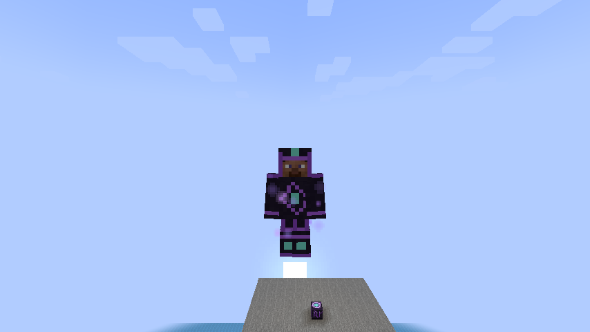
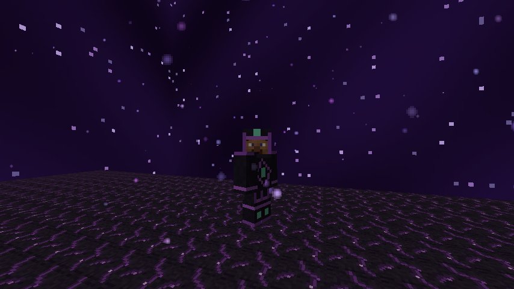

# Riftborn 1.5.0 — Rift Ascension verification

Production commit [`c9f20e7`](https://github.com/benluvzbacon/Minecraft-test/commit/c9f20e7) passed [the complete Java 21 / Minecraft 1.21.1 Fabric CI run](https://github.com/benluvzbacon/Minecraft-test/actions/runs/34031498649).

## Results

| Check | Result |
| --- | --- |
| Existing `./gradlew --no-daemon clean build` | Passed |
| Unit tests | **18 passed**: resources, armor layers/recipes, protected-system fingerprints, terrain-placement cases and query-cost bound |
| Dedicated-server GameTests | **35 passed**, zero failures: all original 20 plus 15 armor/flight regressions |
| Generated PNG/JSON/NBT resources | Reproduced byte-for-byte |
| Production jar | Audited and uploaded: Java 21 bytecode, intermediary mappings, packaged resources and mixin refmaps, no development test mods |
| Real client + normal dedicated server | Passed, including flight controls, removal, modes, dimensions, reconnect, death, and respawn |

## Rift-only placement regression

The old root-piece placement projected onto a single heightmap column. Over a gap between islands the height was **0**, so its ground-level delta put the foundation at **−1**. `dimension_padding` did not reject that root piece. This was reproduced on a normal server before changing the placement implementation.

The same seed (`4197231`) and 49 candidate positions per structure were evaluated before and after the fix:

| Structure | Old usable above-map starts | Old below-map starts | New valid above-map starts | New below-map starts |
| --- | ---: | ---: | ---: | ---: |
| Rift ruin | 31 | 18 | **49** | **0** |
| Guardian shrine | 35 | 14 | **49** | **0** |

Elevations varied naturally: sampled ruin foundations ranged from Y 70–103, and shrine foundations from Y 69–101. The server also located and generated real structures through the normal random-spread system, then checked placed Rift Stone floors at `(24, 74, 40)` and `(248, 77, 24)`.

The fix uses the existing jigsaw pools/pieces and templates, validates sampled terrain across the foundation, searches nearby when necessary, and aligns the root before publishing the structure start. The shrine's circular floor is respected. Half-noise-cell sampling avoids a costly per-block height scan. **Overworld generation is unchanged.** Original templates, placement spacing/separation/salts, mobs, and Riftblade/SafeTeleport code are protected by regression fingerprints.

## Armor and flight

All four recipes crafted their expected armor pieces through Minecraft's recipe manager. Durability, protection, toughness, icons, model texture layers, translations, and resource loading passed checks. Worn armor was captured by a real client:



Flight uses native controls and abilities with a **0.15 flight speed versus vanilla Creative's 0.05**, while retaining Survival/Adventure mode and permissions. Live input checks exercised ascent, descent, horizontal movement, braking, and reversing direction. A server-side assertion independently checked the resulting permission, active-flight state, mode, and speed.

For **each** armor piece, the client removed it, submitted a forged flying request, and confirmed revocation. Server-side checks independently confirmed no active flight or bonus speed. Native Creative behavior, including removing armor, and returning to incomplete-set Survival passed. GameTests also covered armor breakage and Spectator mode.

Both dimension transitions, a real disconnect/reconnect while airborne, death, and respawn without armor passed. The reconnect revalidated the actual equipment after vanilla's login mode setup. Player NBT stores baseline capabilities, not an unconditional flight flag or speed boost. The client and server confirmed that respawned, unarmored Survival had no flight permission.



The screenshots use an explicit test exhibition. They demonstrate real rendering, not a claim that the exhibition was discovered through ordinary survival play.

## Preserved gameplay and build

The original portal/Core consumption, return anchor, compass/POI, recipes, mob AI/attributes/projectiles, Guardian phase and Heart loot, and Riftblade regression tests remain. The real client again completed the original travel/render/blink/cooldown/durability sequence. An additional test confirms that wearing flight armor does **not** bypass the Riftblade's supported-landing/void check.

The Gradle wrapper, Loader/API/Loom versions, Minecraft target, and existing build configuration were retained. The only source-set addition supports development-only normal-world tests. It is excluded from the production jar. Release artifacts remain **jar-only**, with diagnostics separate.

## Distributable

- **`riftborn-1.5.0.jar`** — **180,464 bytes**
- **260 archive entries**, including **46 Java 21 classes**
- SHA-256:

```text
807cb4d63703c0931ceb651f9364e596ced19aaebe8d97e01dc9798bd5cb3e4a
```

The retrieved jar was checksum-verified and independently audited with `scripts/verify_jar.py`. A normal build writes it to `build/libs/riftborn-1.5.0.jar`. The `riftborn-1.21.1` Actions artifact ZIP contains that compiled jar at its root; `-sources.jar` is not an installation jar.

## Scope and updating saves

This is automated verification on the pinned target, not exhaustive testing of every seed, modpack, shader, or multiplayer load. Natural-placement checks cover a fixed seed and many positions, plus synthetic terrain cases. The network test uses one actual client. Extended survival balancing still benefits from playtesting.

The generation fix affects **new chunks**. Existing saved structures are not deleted or relocated, and the old piece/template codecs remain available. Already-generated misplaced structures are not retroactively moved. Back up saves before installing an update.

See [TESTING.md](TESTING.md) for reproduction commands and isolated-test-server precautions.
